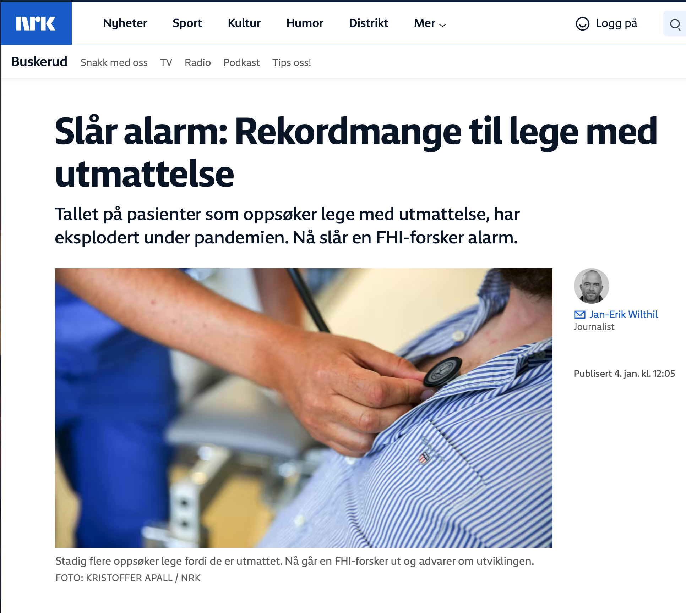

[Publisert på nrk.no den 4. jan 2024](https://www.nrk.no/buskerud/rekordmange-til-lege-med-utmattelse.-fhi-forsker-slar-alarm-om-senfolger-av-covid-19.-1.16678355).

Saken oppsummert:

- Det har vært en dramatisk økning i antall pasienter som oppsøker lege for utmattelse under pandemien.
- Økningen har skjedd i alle aldersgrupper, med unntak av barn i alderen 0–4 år.
- FHI-statistiker Richard Aubrey White og andre forskere er bekymret for utviklingen.
- Økningen i utmattelse kom samtidig med omikronvarianten, og det er en tidsmessig sammenheng mellom smittebølger og økning i utmattelse.
- Flere store studier viser at covid-19 kan gi alvorlige senfølger.
- Forsker og infeksjonsmedisiner Arne Søraas oppfordrer norske folkehelsemyndigheter til å oppdatere seg på internasjonal forskning på området.
- Fagdirektør Preben Aavitsland i FHI mener det ikke er nok god kunnskap til å slå fast at covid-19 fører til alvorlige senfølger.
