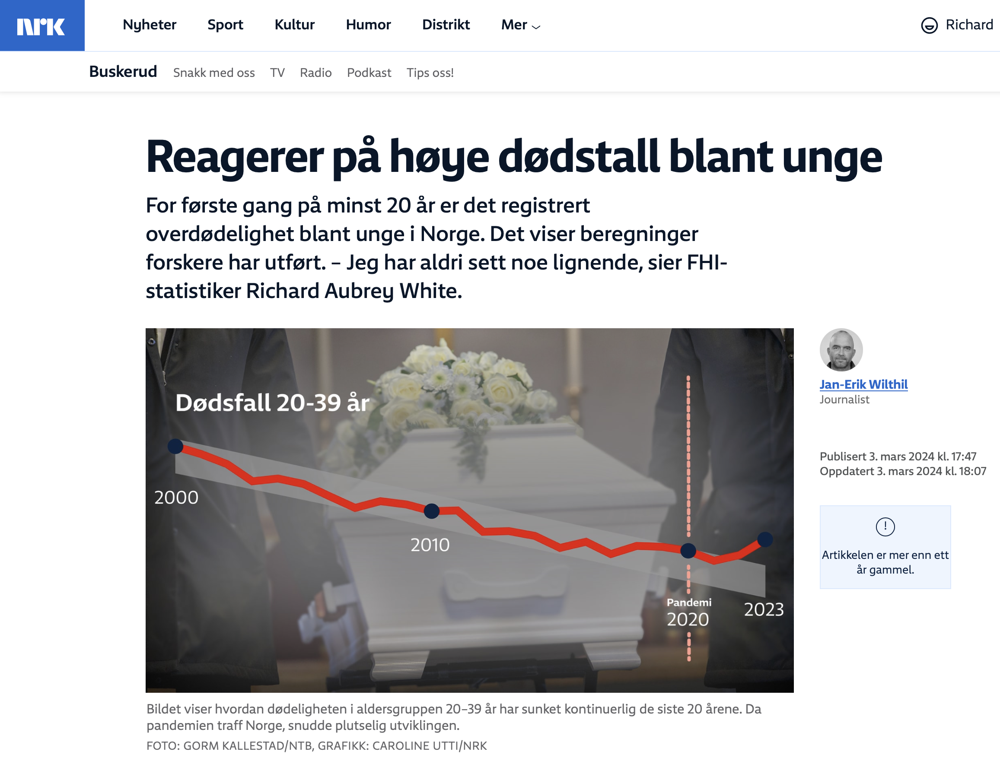

[Publisert på nrk.no den 3. mars 2024](https://www.nrk.no/buskerud/reagerer-pa-hoye-dodstall-blant-unge-1.16766111).

Saken oppsummert:

- For første gang på minst 20 år, er det registrert overdødelighet blant unge i Norge, ifølge beregninger forskere har utført.
- I 2022 ble det registrert en overdødelighet for alle aldersgrupper på hele 11,5 prosent, som tilsvarer 4 682 flere dødsfall enn forventet.
- Overdødeligheten fortsatte også i 2023, og det er ikke bare de eldste som faller bort i større grad enn ventet.
- Forsker Richard Aubrey White mener at covid-19 peker seg ut som en sannsynlig forklaring på overdødeligheten.
- White frykter at gjentatte smittebølger vil skade folkehelsa.
- FHI bekrefter tidvis høyere dødelighet blant unge, men vil ikke spekulere på årsakene før grundigere analyser er gjort.
- Dødsårsaksregisteret er ikke klart før til sommeren, og først da vil det være mulig å få svar på hva som har forårsaket overdødeligheten.
