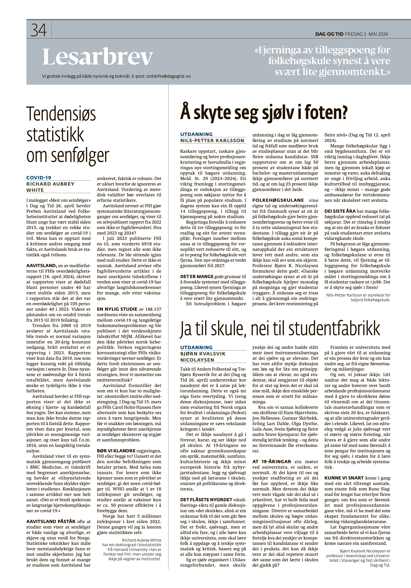

*This is a translation of the original Norwegian op-ed, and discrepancies may exist.*

In the article "[More about long-term consequences](https://www.dagogtid.no/ordskifte/meir-om-seinfolgjer-6.130.34354.2b479464ab)" in Dag og Tid on April 26, Preben Aavitsland at the Norwegian Institute of Public Health claims that mortality among young people has been stable since 2015, and questions a number of studies on long-term consequences of COVID-19. While he is busy criticizing others' handling of facts, Aavitsland's use of statistics is also questionable.

Aavitsland, one of the co-authors of FHI's [excess mortality report](https://www.fhi.no/publ/2024/dodelighet-i-norge-under-koronapandemien-2020-2023/) (April 16, 2024), writes that the report shows that deaths among people under 40 have been stable since 2015, but the report states that there was an excess mortality of 105 people under 40 in 2023. Furthermore, the claim about a "stable trend" from 2015 to 2019 is incorrect.

The trend from 2000 to 2019 reveals that Aavitsland's "stable trend" is normal variation within a 20-year constant decline, abruptly ended by an upturn in 2023. The report only shows data from 2010, which artificially emphasizes random variation in later years. These nuances are necessary to understand the overall picture, but Aavitsland's desire is obviously not to show the whole picture.

Aavitsland claims that the FHI report shows that there is no increase in heart and cardiovascular deaths among younger people. That may be true, but one cannot use this report to establish this. The report shows data per quarter, which is affected by seasonal variations, and only shows figures from 2016 onwards, without a long-term trend analysis.

Aavitsland refers to a [systematic review](https://bmcmedicine.biomedcentral.com/articles/10.1186/s12916-023-03162-5) published in BMC Medicine, a journal with limited recognition, and claims that "apparently concerning findings are due to biases in the studies." The conclusion in the same article says something completely different: "There is a broad spectrum of long-term cardiac complications of COVID-19."

Aavitsland often claims that studies showing that long-term consequences are both [common and serious](https://www.nature.com/articles/s41591-023-02521-2) are biased and without value for Norway. [Statistical techniques](https://www.acpjournals.org/doi/10.7326/M16-2607) can measure how resistant findings are to unmeasured biases. I have used them and found that many of the studies that Aavitsland has dismissed are actually robust. It is unclear why they are ignored by Aavitsland. Assessment of methodological validity should be left to experienced statisticians.

Aavitsland mentions that FHI conducts systematic literature reviews on long-term consequences, and refers to a [self-published report](https://www.fhi.no/publ/2022/senfolger-etter-covid-19-og-nyoppstatt-sykdom-etter-covid-19/) from 2022 that is not peer-reviewed. What about 2023 and 2024?

In July 2023, [FHI published another one](https://www.fhi.no/en/publ/2023/senfolger-etter-covid-19-som-folge-av-omikronsmitte/) that evaluated 6,918 studies but considered all as irrelevant. They were left with zero studies. This is not an exception. Aavitsland often dismisses peer-reviewed articles in the most recognized journals in the world that show that COVID-19 has serious long-term consequences for many, even after vaccination.

[A recent study](https://www.nejm.org/doi/full/10.1056/NEJMc2311200) of 188,137 Norwegians showed a connection between COVID-19 and long-term memory problems and was published in the world-renowned journal NEJM. Nevertheless, it has not influenced Norwegian health policy. Neither [the government's corona strategy](https://www.regjeringen.no/no/dokumenter/regjeringens-strategi-og-beredskapsplan-for-handteringen-av-covid-19-pandemien/id2987438/) nor [FHI's risk assessments](https://www.fhi.no/publ/statusrapporter/risikovurdering-for-luftveisinfeksjoner/) mention long-term consequences. Is this because the existence of long-term consequences goes against the current strategy, where we oppose infection control measures?

Aavitsland presents it as if we only have two options: uncontrolled infection or lockdown. In [Dag og Tid March 15](https://www.dagogtid.no/samfunn/helse/for-ein-mildare-pandemi-6.121.33729.ebf4b38e0a), FHI's Carol Holm-Hansen gave several alternatives that can protect us without being intrusive. But before we talk about the solution, authorities must first acknowledge that long-term consequences exist and constitute a societal problem.

Should we blame the government, FHI, or both? Regardless, it is the Norwegian population that pays the price. With health at stake. For readers who don't know anyone affected by long-term consequences, give it a few more COVID waves. WHO estimates that 1 in 10 infections results in long-term consequences, and studies estimate that vaccines are only about 50 percent effective in preventing them.

Norway has had 5 million infections per year since 2022. This time I'll let the reader do the statistics themselves.

*Richard Aubrey White has a PhD in biostatistics from Harvard University. He is a researcher at FHI, but does not speak on behalf of the institute.*
