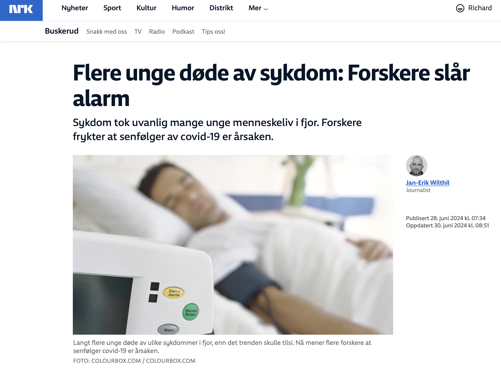

[Publisert på nrk.no den 28. juni 2024](https://www.nrk.no/buskerud/flere-unge-dode-av-sykdom_-forskere-slar-alarm-1.16926584).

Saken oppsummert:

- I 2023 døde 378 nordmenn i alderen 1 til 39 år av sykdom, en overdødelighet på over 50% sammenlignet med utviklingen i perioden 2010 til 2019.
- Flere forskere mistenker at senfølger av covid-19 kan være årsaken til den økte dødeligheten.
- Sykdommer som kreft og hjerte- og karsykdommer krevde flere liv enn ventet, men den største økningen kom i kategorien «alle andre sykdommer».
- Forsker Richard White frykter at konsekvensene av covid-19 ikke blir tilstrekkelig vurdert av norske myndigheter.
- Infeksjonslege og koronaforsker Arne Søraas ber helseministeren om å gripe inn.
- Fagdirektør Preben Aavitsland i FHI mener det er lite som tyder på at senfølger av covid-19 fører til økt dødelighet.