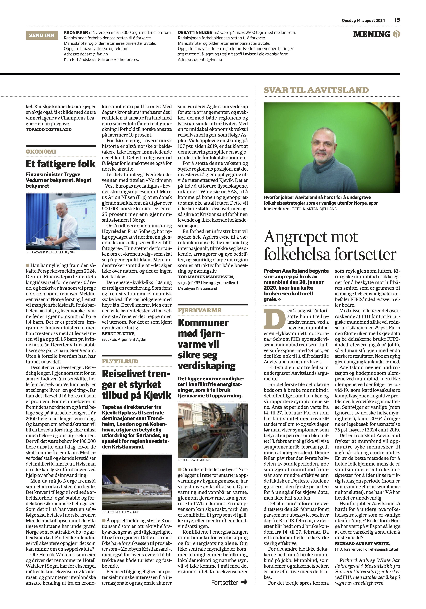

*Richard Aubrey White har doktorgrad i biostatistikk fra Harvard University og er forsker ved FHI, men uttaler seg ikke på vegne av arbeidsgiveren.*

Preben Aavitsland begynte sine angrep på bruk av munnbind den 30. januar 2020, hvor han kalte bruken «en kulturell greie.» Den 2. august i år fortsatte han i Fædrelandsvennen, ved å hevde at munnbind er en «[lykkeamulett mot korona](https://www.fvn.no/mening/ukeslutt/i/wgr4X1/en-lykkeamulett-mot-korona).» Selv om [FHIs nye studie](https://www.bmj.com/content/386/bmj-2023-078918) viser at munnbind reduserer luftveisinfeksjoner med 29 pst., er det ikke nok til å tilfredsstille Aavitsland om at de virker.

FHI-studien har tre feil som undergraver Aavitslands argumenter.

For det første ble deltakerne bedt om å bruke munnbind i det offentlige rom i to uker, og så rapportere symptomene sine. Anta at perioden varte fra 14. til 27. februar: For en som har blitt smittet med covid-19 tar det mellom [to og seks dager](https://assets.publishing.service.gov.uk/media/641c7a9b32a8e0000cfa9327/COVID-19-infectiousness-_asymptomatic-transmission.pdf) før man viser symptomer, som betyr at en person som ble smittet 13. februar trolig ikke vil vise symptomer før 18. februar (godt inne i studieperioden). Denne feilen påvirker den første halvdelen av studieperioden, noe som gjør at munnbind fremstår som mindre effektive enn de faktisk er. De fleste studiene ignorerer den første perioden for å unngå slike skjeve data, men ikke FHI-studien.

Det blir som å utføre en graviditetstest den 28. februar for et par som har ubeskyttet sex hver dag fra 8. til 13. februar, og deretter blir bedt om å bruke kondom fra 14. til 27. februar. Da vil kondomer heller ikke virke særlig effektive.

For det andre ble ikke deltakerne bedt om å bruke munnbind på jobb. Munnbind, som kondomer og sikkerhetsbelter, er bare effektive mens de brukes.

For det tredje [spres korona som røyk gjennom luften](https://www.betterhealth.vic.gov.au/covid-19/improving-ventilation-stop-spread-covid-19?utm_source=social&utm_medium=facebookinstagram&utm_campaign=COVID&utm_content=Ventilation). Kirurgiske munnbind er ikke egnet for å beskytte mot luftbåren smitte, som er grunnen til at mange helsemyndigheter [anbefaler FFP2-åndedrettsvern eller bedre](https://www.betterhealth.vic.gov.au/covid-19/face-masks-covid-19).

Med disse feilene er det overraskende at FHI fant at kirurgiske munnbind allikevel reduserte risikoen med 29 pst. Fjern den første uken med skjev data og be deltakerne bruke FFP2-åndedrettsvern (også på jobb), så vil man stå igjen med enda sterkere resultater. Noe en [nylig gjennomgang](https://journals.asm.org/doi/10.1128/cmr.00124-23) konkluderte med.

Aavitsland nevner hudirritasjon og hodepine som ulempene ved munnbind, men ikke [ulempene](https://covidforeningen.no/Om-Long-Covid) ved senfølger av covid-19, som kardiovaskulære komplikasjoner, kognitive problemer, hjernetåke og utmattelse. Senfølger er vanlige (men [ignorert av norske helsemyndigheter](https://www.nrk.no/buskerud/norsk-covidforening-om-mulige-senfolger-av-korona_-_-folk-taler-a-hore-sannheten-1.16703052)); blant 20-64 åringene er legebesøk for utmattelse [75 pst. høyere i 2024 enn i 2019](https://www.nrk.no/buskerud/flere-unge-dode-av-sykdom_-forskere-slar-alarm-1.16926584).

Det er ironisk at Aavitsland frykter at munnbind vil oppmuntre syke mennesker til å gå på jobb og smitte andre. En av de beste metodene for å holde folk hjemme mens de er smittsomme, er å bruke hurtigtester for å identifisere riktig isolasjonsperiode ([noen er smittsomme etter at symptomene har sluttet](https://www.ncbi.nlm.nih.gov/pmc/articles/PMC9981266/)), noe han [i VG](https://www.vg.no/nyheter/innenriks/i/8JK78r/fhi-om-coronatesting-jeg-gidder-ikke) har hevdet er unødvendig.

Hvorfor jobber Aavitsland så hardt for å undergrave folkehelsestrategier som er vanlige utenfor Norge? Er det fordi Norge har vært på villspor så lenge at det er vanskelig å snu uten å miste ansikt?
