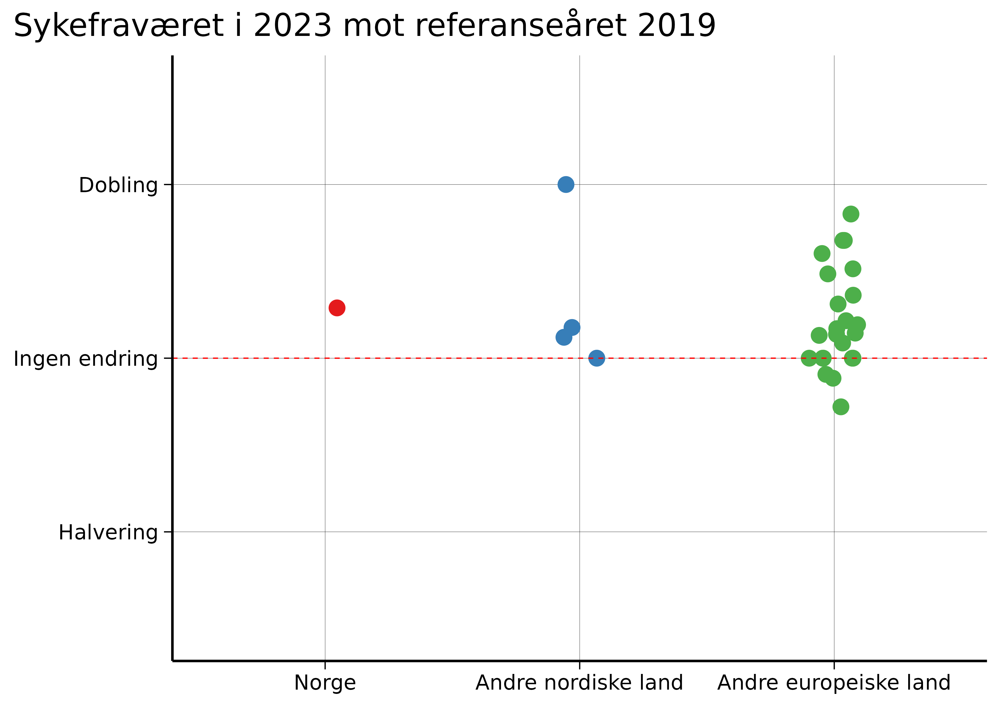

.](top.png)

På Debatten 7. januar spurte Erna Solberg «Det er ikke bare i Norge [sykefraværet] økte, ... men i de fleste andre land har sykefraværet gått ned igjen nå, men ikke her. Hvorfor?»

**Dette spørsmålet har preget Norge i flere måneder, men dessverre, er debatten ført på feil premisser.**

Det er tre tidsperioder som er relevante i diskusjonen om sykefravær: 2019 («før pandemien»), 2020–2022 («pandemiårene») og 2023 («etter pandemien»).

Under årene med pandemi hadde hvert land ulike tiltak, men i etterkant har alle europeiske land valgt samme strategi: Ignorere covid og dens senfølger.

Dette betyr at Solbergs [sammenligning](https://www.ssb.no/arbeid-og-lonn/arbeidsmiljo-sykefravaer-og-arbeidskonflikter/artikler/norge-skiller-seg-ut-med-hoyt-sykefravaer-etter-pandemien) i praksis er en skjult sammenligning av pandemitiltak, siden disse varierte betydelig mellom landene. I 2023 er det ingen forskjeller mellom landenes strategier for tiden etter pandemien.

**Dette gir inntrykk av at Norge gjør det «dårlig» sammenlignet med andre land, men dette er en feilaktig konklusjon. Grunnen er enkel: Norge gjorde en eksepsjonelt god jobb under pandemien.**

Dermed fremstår andre land som om de har «forbedret» seg etter pandemien, når sannheten er at deres pandemi-strategier var svake.

I tillegg, når vi sammenligner sykefraværet i 2023 med 2022, ser vi at Norge faktisk ligger midt på treet i Europa.

**Dette viser at hysteriet rundt norsk sykefravær er sterkt overdrevet.**

For å få en nøytral vurdering av dagens sykefravær, bør vi sammenligne 2023 med 2019, da 2019 representerer et referanseår som ikke er påvirket av pandemien.

**Denne analysen avdekker to viktige funn:**

De fleste europeiske land har høyere sykefravær i 2023 enn i 2019, og Norge er helt gjennomsnittlig i denne sammenligningen.

Med dette perspektivet blir det klart at oppstyret rundt norsk sykefravær er ubegrunnet. Norge står seg godt i et europeisk perspektiv etter pandemien.

## Hvorfor er sykefraværet høyere nå enn i 2019?

Fra 2023 har de fleste europeiske land hatt en la det skure-strategi med fri smitte, der mange blir smittet av covid-19 minst én gang i året.

Den 10. januar 2025 publiserte forskere fra FHI [en studie](https://www.sciencedirect.com/science/article/pii/S0264410X2401346X) som viser at blant nordmenn med tre vaksinedoser hadde omikronsmitte en risiko på 6 prosent for langvarige symptomer, kjent som «long covid» eller «senfølger av covid-19».

**Dette innebærer at [opptil 250.000 nordmenn](https://archive.ph/Cm30Y) kan få long covid hvert år. Det er tydelig at dette vil øke sykefraværet – noe vi allerede ser i tallene.**

To [vitenskapelige](https://archpublichealth.biomedcentral.com/articles/10.1186/s13690-024-01411-4) [artikler](https://arbeidogvelferd.nav.no/journal/2024/2/m-1546/Hvorfor_er_sykefraværet_fortsatt_høyt_3–4_år_etter_starten_av_pandemien) fra to norske forskergrupper kom uavhengig av hverandre til samme konklusjon: En betydelig del av økningen i det norske sykefraværet skyldes sykdommer knyttet til akutt covid-19 og senfølger av covid-19. En studie fant til og med en tidsmessig sammenheng med koronabølger.

## «Men hva med resten av verden? De har også covid!»

Ja, og vi ser lignende trender der.

Fra [2012](https://www.cis.es/en/detalle-ficha-estudio?origen=estudio&idEstudio=14085) til [2019](https://www.cis.es/detalle-ficha-estudio?origen=estudio&idEstudio=14477) var andelen voksne i Spania som rapporterte om en kronisk helsetilstand stabil på rundt 30 prosent. Da undersøkelsen startet opp igjen tidlig i [2022](https://www.cis.es/detalle-ficha-estudio?origen=estudio&idEstudio=14619), hadde denne andelen hoppet til 42,3 prosent. I den siste rapporten fra [oktober 2024](https://www.cis.es/detalle-ficha-estudio?origen=estudio&idEstudio=14857) var andelen oppe i 49,5.

I [USA](https://fred.stlouisfed.org/series/LNU00074597) var det fra 2015 til 2019 omtrent 30 millioner voksne med en funksjonsnedsettelse. Tidlig i 2022 var tallet cirka 32 millioner, og nå, i november 2024, er det 34,8 millioner.

I [Storbritannia](https://www.ons.gov.uk/employmentandlabourmarket/peoplenotinwork/economicinactivity/datasets/economicinactivitybyreasonseasonallyadjustedinac01sa) var antallet voksne som var ute av arbeid på grunn av langvarig sykdom stabilt på rundt to millioner fra 2013 til 2019. Sent i 2021 nådde det 2,4 millioner, og nå ligger det på 2,8 millioner.

**Dette er selvfølgelig kun indisier, men det er også akkurat hva vi forventer å se fra millioner av gjentatte koronainfeksjoner hvert år.**

## Som å spille russisk rulett med kronisk sykdom

[Covid er farligere enn du tror](https://www.nrk.no/ytring/covid-er-farligere-enn-du-tror-1.17116008). Hver reinfeksjon er som å spille russisk rulett med kronisk sykdom. Sykefravær er bare toppen av isfjellet.

Mange med long covid er fortsatt i full jobb, bare med betydelig redusert livskvalitet. I tillegg finnes det ulike grader av long covid – for de med mild long covid kan reinfeksjon forverre tilstanden. Forebygging er derfor avgjørende.

**Med målrettede tiltak mot det luftbårne koronaviruset kan vi redusere covid-19 betydelig med lavterskeltiltak:**

- Informasjonskampanjer om risikoen for long covid ([som i Australia](https://youtu.be/FlBfq22nxt8?feature=shared)) for å informere befolkningen om hvorfor det er så viktig å fortsette å bekjempe covid-19.
- [Forbedre ventilasjon](https://eprints.qut.edu.au/247686/1/MORAWSKA_Mandating_IAQ_for_public_buildings.pdf) og luftfiltrering, spesielt i skoler og på sykehus. Dette gjøres i mange land, som Australia og USA, men ikke i Norge.
- UV-C-desinfisering av luft, som brukes for å [beskytte mot tuberkulose](https://www.cdc.gov/niosh/docs/2009-105/default.html).
- Anbefalinger om å bruke [FFP2-munnbind](https://journals.asm.org/doi/10.1128/cmr.00124-23) innendørs og på kollektivtransport når det er mye smitte.
- Bevare dagens sykefraværsordning, slik at folk har råd til å bli hjemme mens de er syke og/eller smittsomme. En [studie fra FHI](https://bmjopen.bmj.com/content/9/4/e027832) viser at rask sykemelding ved nye oppståtte luftveissymptomer er kostnadseffektivt fordi det hindrer videre smitte til kollegaer.

*Richard Aubrey White er forsker ved Folkehelseinstituttet, men skriver ikke på vegne av arbeidsgiveren.*
