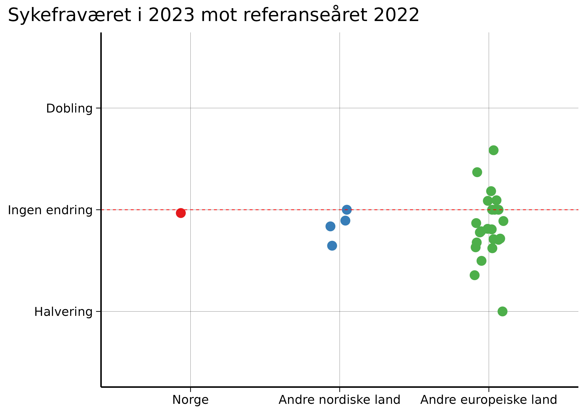

*This is a translation of the original Norwegian op-ed, and discrepancies may exist.*

.](top.png)

On "The Debate" on January 7, Erna Solberg asked: "It's not just in Norway that [sick leave] increased, ... but in most other countries, sick leave has gone down again now, but not here. Why?"

**This question has dominated Norway for several months, but unfortunately, the debate is based on wrong premises.**

There are three time periods relevant to the discussion about sick leave: 2019 ("before the pandemic"), 2020–2022 ("the pandemic years"), and 2023 ("after the pandemic").

During the pandemic years, each country had different measures, but afterwards, all European countries chose the same strategy: Ignore COVID and its long-term consequences.

This means that Solberg's [comparison](https://www.ssb.no/arbeid-og-lonn/arbeidsmiljo-sykefravaer-og-arbeidskonflikter/artikler/norge-skiller-seg-ut-med-hoyt-sykefravaer-etter-pandemien) is in practice a hidden comparison of pandemic measures, since these varied significantly between countries. In 2023, there are no differences between countries' strategies for the post-pandemic period.

**This gives the impression that Norway is doing "poorly" compared to other countries, but this is a false conclusion. The reason is simple: Norway did an exceptionally good job during the pandemic.**

Thus, other countries appear to have "improved" after the pandemic, when the truth is that their pandemic strategies were weak.

In addition, when we compare sick leave in 2023 with 2022, we see that Norway is actually in the middle of the pack in Europe.

**This shows that the hysteria around Norwegian sick leave is greatly exaggerated.**

To get a neutral assessment of today's sick leave, we should compare 2023 with 2019, as 2019 represents a reference year that is not affected by the pandemic.

**This analysis reveals two important findings:**

Most European countries have higher sick leave in 2023 than in 2019, and Norway is completely average in this comparison.

With this perspective, it becomes clear that the uproar around Norwegian sick leave is unfounded. Norway is doing well in a European perspective after the pandemic.

## Why is sick leave higher now than in 2019?

From 2023, most European countries have had a "let it rip" strategy with free transmission, where many get infected with COVID-19 at least once a year.

On January 10, 2025, researchers from the Norwegian Institute of Public Health (FHI) published [a study](https://www.sciencedirect.com/science/article/pii/S0264410X2401346X) showing that among Norwegians with three vaccine doses, omicron infection had a 6 percent risk of long-lasting symptoms, known as "long COVID" or "long-term consequences of COVID-19."

**This means that [up to 250,000 Norwegians](https://archive.ph/Cm30Y) can get long COVID each year. It is clear that this will increase sick leave – something we already see in the numbers.**

Two [scientific](https://archpublichealth.biomedcentral.com/articles/10.1186/s13690-024-01411-4) [articles](https://arbeidogvelferd.nav.no/journal/2024/2/m-1546/Hvorfor_er_sykefraværet_fortsatt_høyt_3–4_år_etter_starten_av_pandemien) from two Norwegian research groups independently reached the same conclusion: A significant portion of the increase in Norwegian sick leave is due to diseases related to acute COVID-19 and long-term consequences of COVID-19. One study even found a temporal connection with coronavirus waves.

## "But what about the rest of the world? They also have COVID!"

Yes, and we see similar trends there.

From [2012](https://www.cis.es/en/detalle-ficha-estudio?origen=estudio&idEstudio=14085) to [2019](https://www.cis.es/detalle-ficha-estudio?origen=estudio&idEstudio=14477), the proportion of adults in Spain who reported having a chronic health condition was stable at around 30 percent. When the survey resumed in early [2022](https://www.cis.es/detalle-ficha-estudio?origen=estudio&idEstudio=14619), this proportion had jumped to 42.3 percent. In the latest report from [October 2024](https://www.cis.es/detalle-ficha-estudio?origen=estudio&idEstudio=14857), the proportion was up to 49.5 percent.

In the [USA](https://fred.stlouisfed.org/series/LNU00074597), from 2015 to 2019, there were approximately 30 million adults with a disability. Early in 2022, the number was about 32 million, and now, in November 2024, it is 34.8 million.

In the [UK](https://www.ons.gov.uk/employmentandlabourmarket/peoplenotinwork/economicinactivity/datasets/economicinactivitybyreasonseasonallyadjustedinac01sa), the number of adults who were out of work due to long-term illness was stable at around two million from 2013 to 2019. Late in 2021, it reached 2.4 million, and now it stands at 2.8 million.

**This is of course only circumstantial evidence, but it is also exactly what we expect to see from millions of repeated coronavirus infections each year.**

## Like playing Russian roulette with chronic disease

[COVID is more dangerous than you think](https://www.nrk.no/ytring/covid-er-farligere-enn-du-tror-1.17116008). Each reinfection is like playing Russian roulette with chronic disease. Sick leave is just the tip of the iceberg.

Many with long COVID are still in full-time work, just with significantly reduced quality of life. In addition, there are different degrees of long COVID – for those with mild long COVID, reinfection can worsen the condition. Prevention is therefore crucial.

**With targeted measures against the airborne coronavirus, we can significantly reduce COVID-19 with low-threshold measures:**

- Information campaigns about the risk of long COVID ([as in Australia](https://youtu.be/FlBfq22nxt8?feature=shared)) to inform the population about why it is so important to continue fighting COVID-19.
- [Improve ventilation](https://eprints.qut.edu.au/247686/1/MORAWSKA_Mandating_IAQ_for_public_buildings.pdf) and air filtration, especially in schools and hospitals. This is done in many countries, such as Australia and the USA, but not in Norway.
- UV-C air disinfection, which is used to [protect against tuberculosis](https://www.cdc.gov/niosh/docs/2009-105/default.html).
- Recommendations to use [FFP2 masks](https://journals.asm.org/doi/10.1128/cmr.00124-23) indoors and on public transport when there is high transmission.
- Preserve today's sick leave system, so people can afford to stay home while they are sick and/or infectious. A [study from FHI](https://bmjopen.bmj.com/content/9/4/e027832) shows that rapid sick leave for newly emerging respiratory symptoms is cost-effective because it prevents further transmission to colleagues.

*Richard Aubrey White is a researcher at the Norwegian Institute of Public Health, but does not write on behalf of his employer.*
