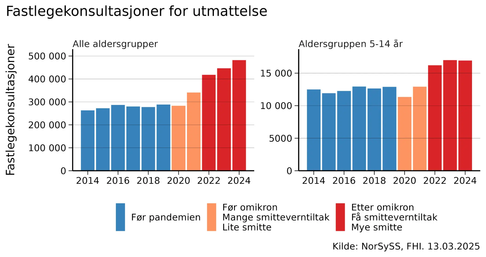

*This is a translation of the original Norwegian op-ed, and discrepancies may exist.*

.](top.png)

March 12, 2025, marked a [historic moment](https://www.nrk.no/buskerud/erna-solberg-vil-at-norge-skal-ta-et-nytt-koronagrep-for-a-takle-_long-covid_-1.17336151) for Norwegian public health. Erna Solberg acknowledged that long COVID may be an important cause of [increased sick leave](https://frifagbevegelse.no/debatt/debatten-om-sykefravar-er-fort-pa-feil-premisser-6.490.1106983.a33706873a) and made an election promise to improve treatment.

But treatment is only half the solution. We must also prevent.

[Long COVID is caused by coronavirus infections](https://www.nrk.no/ytring/covid-er-farligere-enn-du-tror-1.17116008). The more often people get infected, the more will develop long COVID. If we reduce transmission, fewer will become chronically ill.

Early in the pandemic, it was mistakenly believed that the coronavirus spread via droplets. Now we know that [the coronavirus is airborne](https://www.nature.com/articles/s41598-023-47829-8) – it spreads in the air like smoke. Fortunately, airborne viruses can be prevented by purifying indoor air.

Florence Nightingale wrote in 1859: "The very first rule of nursing: Keep the air he breathes as pure as outdoor air." This principle should be something we strive for today as well. By purifying the air, we can prevent respiratory infections, allergic problems, and other discomfort.

We have three effective methods for purifying indoor air: ventilation, filtration, and UVC light.

- Ventilation supplies fresh air, ideally through balanced ventilation.
- Air filtration removes airborne viruses using air purifiers. Finland has successfully used this in [kindergartens to reduce sick leave](https://yle.fi/a/74-20062381). FHI and SINTEF [are researching whether air filtration can prevent infections with the new coronavirus](https://www.fhi.no/sm/luftrenserstudien/), but research [takes time](https://trialsjournal.biomedcentral.com/articles/10.1186/s13063-024-08547-2).
- UVC light has for decades been used in schools and hospitals to prevent the spread of [measles, tuberculosis, and influenza](https://pmc.ncbi.nlm.nih.gov/articles/PMC2789813/). Newer "[far UVC](https://www.nature.com/articles/s41598-022-08462-z)" technology is even safer and easier to install in high-traffic areas such as public transport and corridors. [Danish ambulances](https://uvmedico.com/news/uv-medico-falck-elevating-ambulance-safety-with-uv222-technology) and [the U.S. military](https://www.defense.gov/News/Feature-Stories/Story/Article/2309289/air-guard-wing-receives-dods-first-uv-light-disinfectant-system/) already use this technology.

**An "indoor climate" revolution is happening around the world – but Norway is lagging behind**

The Biden administration developed, as a consequence of the pandemic, new [indoor climate standards to protect public health](https://www.ashrae.org/about/news/2023/ashrae-approves-groundbreaking-standard-to-reduce-the-risk-of-disease-transmission-in-indoor-spaces). Japanese restaurants display real-time measurements of [air quality](https://x.com/ToshiAkima/status/1488150477993025542). [Australia has recently passed a law](https://www.parliament.nsw.gov.au/Hansard/Pages/HansardResult.aspx#/docid/HANSARD-1820781676-98120/link/2300) stating that "students and staff in public schools deserve a safe learning environment, including good air quality … Poorly ventilated indoor spaces increase the spread of airborne diseases and pose a risk to young people, staff, and the entire community."

While other countries are taking action, Norway is lagging behind. The Norwegian Institute of Public Health's [indoor climate expert group](https://www.dagensmedisin.no/fhi-folkehelseinstituttet-inneklima/fhi-kutter-inneklima-fagmiljo/531987) was disbanded, during a period when the number of coronavirus infections increased significantly. In the time since, general practitioner consultations for exhaustion and [sick leave related to long COVID](https://archpublichealth.biomedcentral.com/articles/10.1186/s13690-024-01411-4) have increased sharply. These problems affect not only adults but [also children](https://publications.aap.org/pediatrics/article/153/3/e2023062570/196606/Postacute-Sequelae-of-SARS-CoV-2-in-Children?autologincheck=redirected), who are constantly infected in [schools with poor indoor climate](https://www.nrk.no/vestland/230.000-norske-elevar-i-klasserom-med-darleg-luft-1.15993604) and risk long-term health problems.

**Teachers are exposed – long COVID can be an occupational injury**

Children don't just infect each other – they can also infect their families and their teachers, even when children [themselves have no symptoms](https://academic.oup.com/cid/article/78/6/1522/7634443). Some of them also get long COVID. 36% of [injury reports related to COVID-19](https://www.nav.no/no/nav-og-samfunn/statistikk/flere-statistikkomrader/relatert-informasjon/mottatte-skademeldinger-knyttet-til-covid-19) have come from teachers, kindergarten employees, and other school staff. [Long COVID can be an occupational injury](https://www.utdanningsnytt.no/corona-inneklima-korona/sykdommen-som-ikke-gikk-over/434365). Trade unions must take action to ensure that schools become safe workplaces. This type of transmission can to some extent be prevented by improved air purification or ventilation in schools and kindergartens.

**Good indoor climate is crucial for Norway's preparedness**

Improved indoor climate is not just about comfort, health, air quality, or preventing long COVID today. It is also important for Norway's preparedness. We know that new pandemics will come. If we now make an effort to achieve safer indoor climate in Norwegian schools, kindergartens, and other public buildings, we will be better protected next time. It will function as a transmission-reducing measure, but it will also help limit the need for shutdowns. A better indoor climate protects us against the increasingly likely [bird flu pandemic](https://www.vg.no/nyheter/i/nybJrB/fugleinfluensa-norge-har-sikret-seg-vaksineavtale) – and other future airborne pandemias.

Norway has much to gain by acting now. Will Norwegian politicians help ensure Norway's public health, workforce, and preparedness – or let Norway fall behind?

*Richard Aubrey White does not write on behalf of FHI.*
