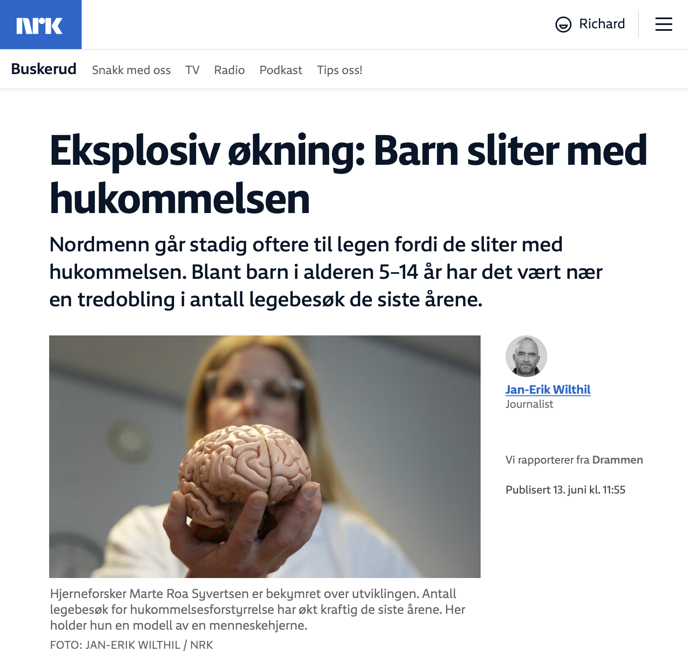

[Publisert på nrk.no den 13. juni 2025](https://www.nrk.no/buskerud/eksplosiv-okning_-barn-sliter-med-hukommelsen-1.17448953).

Saken oppsummert:

- Antall legebesøk for hukommelsesforstyrrelser har økt kraftig, også blant barn i alderen 5–14 år.
- Forsker Richard Aubrey White mener senfølger av covid-19 kan være en vesentlig årsak til økningen, basert på data som viser økning i hukommelsesproblemer etter pandemibølger.
- Hjerneforsker Marte Roa Syvertsen peker på skjermbruk og sosiale medier som mulige årsaker, og understreker viktigheten av søvn, fysisk aktivitet og sosial kontakt.
- FHI er forsiktige i sine tolkninger og peker på at økt bruk av diagnosekoder og flere fastleger kan bidra til økningen, men etterlyser mer forskning.
- Toppforskeren David Putrino advarer om at gjentatte koronainfeksjoner kan føre til kognitive problemer hos barn.
